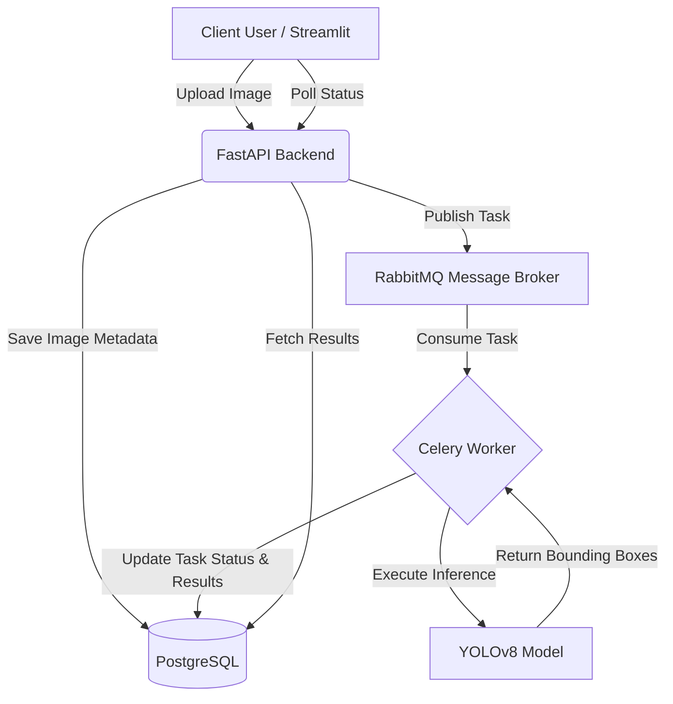
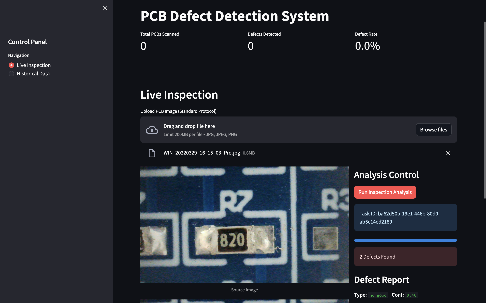
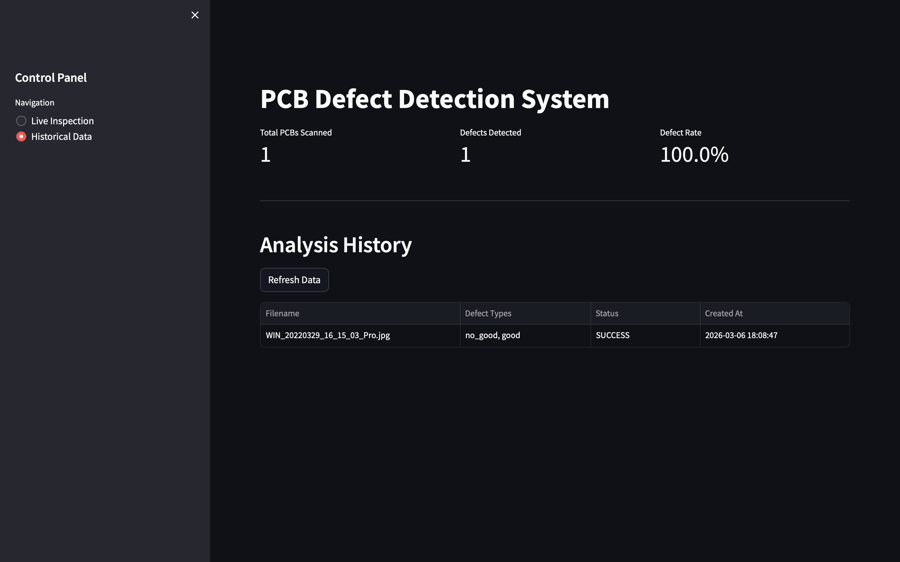

# 🔍 PCB Defect Detection System


## 📖 Project Overview

The **PCB Defect Detection System** is a full-stack, AI-powered pipeline designed to automate the quality assurance process in manufacturing. Built as a scalable proof-of-concept, it demonstrates the seamless integration of modern web backend services, asynchronous task queues, and state-of-the-art computer vision to identify printed circuit board defects (e.g., short circuits, missing components, or soldering issues) in real-time.

By abstracting the heavy computation of deep learning models behind an event-driven architecture, this system ensures high reliability, responsiveness, and horizontal scalability, mimicking production-ready enterprise environments.

---

## ✨ Key Features

- **🧠 Deep Learning Core**: Utilizes **YOLOv8** (via Ultralytics) for high-precision, real-time object detection and defect classification.
- **⚡ Asynchronous Processing Architecture**: Leverages **Celery** and **RabbitMQ** to offload heavy machine learning inference tasks, preventing API blocking and ensuring a smooth user experience.
- **📊 Persistent Inspection Tracking**: Employs a **PostgreSQL** relational database (managed via SQLAlchemy) to historically log every scan, enabling quality trend analysis and auditing.
- **🌐 Interactive Dashboard**: Features a lightweight, intuitive frontend built with **Streamlit** for effortless image uploads and visual bounding-box result rendering.
- **🐳 Containerized Orchestration**: Fully dockerized ecosystem allowing one-click multi-container deployment using Docker Compose.

---

## 🏗️ System Architecture

This project is built using a decoupled, microservices-oriented architecture:

1. **Client Interface (Streamlit)**: Users upload PCB images via the web dashboard.
2. **API Gateway (FastAPI)**: Receives the payload, validates it, and immediately returns a `task_id`.
3. **Message Broker (RabbitMQ)**: Routes inference jobs to available background workers.
4. **Task Handlers (Celery)**: Consume messages, execute the YOLOv8 model against the image, and output predictions.
5. **Database Layer (PostgreSQL)**: Stores the initial job status and eventually updates it with the inference results.
6. **Result Retrieval**: The UI polls the API to retrieve the completed analysis and displays the annotated image.

---

## 🛠️ Technology Stack

| Layer | Technologies Used |
| :--- | :--- |
| **Model / ML** | YOLOv8 (Ultralytics), PyTorch |
| **Backend API** | FastAPI, Pydantic, SQLAlchemy |
| **Task Queue** | Celery, RabbitMQ |
| **Database** | PostgreSQL |
| **Frontend** | Streamlit |
| **DevOps** | Docker, Docker Compose |

---

## 🗄️ Database Schema

The system uses **PostgreSQL** to maintain a persistent record of all inspections. The primary table `prediction_history` tracks the lifecycle of each ML task:

- **`id`**: Primary Key (Integer)
- **`task_id`**: Unique identifier for the Celery task (String)
- **`filename`**: Internal filename on the server (String)
- **`original_filename`**: Original name provided by the user (String)
- **`status`**: Current state (`PENDING`, `SUCCESS`, `FAILURE`)
- **`result`**: JSON blob containing bounding boxes, defect types, and confidence scores
- **`created_at`**: Timestamp of the inspection

---

## 📁 Project Structure

```text
.
├── backend/                  # FastAPI Application Core
│   ├── app/                  # Application Logic (Routes, Models, Services)
│   └── tests/                # Unit and Integration Tests
├── frontend/                 # Streamlit UI
│   └── app.py                # Main Dashboard Script
├── ml/                       # Machine Learning Artifacts
│   ├── yolov8_model/         # Pre-trained/Fine-tuned Weights (best.pt)
│   └── data/                 # Training/Validation Datasets
├── uploads/                  # Temporary Volatile Storage for Image Processing
├── docker-compose.yml        # Multi-container Deployment Config
└── Dockerfile                # Image build instructions
```

---

## ⚙️ Installation Guide

### Prerequisites
- [Git](https://git-scm.com/)
- [Docker](https://www.docker.com/get-started) and [Docker Compose](https://docs.docker.com/compose/install/)

### Local Setup

1. **Clone the repository:**
   ```bash
   git clone <repo-url>
   cd pcb-defect-detection
   ```

2. **Deploy via Docker Compose:**
   The easiest way to spin up the entire ecosystem (Database, Broker, Backend, Celery Worker, and Frontend) is using Docker Compose.
   ```bash
   docker-compose up --build -d
   ```
   *Note: The `-d` flag runs the containers in detached mode.*

3. **Verify running containers:**
   ```bash
   docker-compose ps
   ```

---

## 🚀 Usage / Running the System

Once the instances are running, you can access the different components at the following local addresses:

- **Interactive UI Dashboard**: [http://localhost:8501](http://localhost:8501)
- **FastAPI Interactive Docs (Swagger UI)**: [http://localhost:8000/docs](http://localhost:8000/docs)
- **RabbitMQ Management Console** *(If configured)*: `http://localhost:15672`

**To run an inspection:**
1. Open the Streamlit Dashboard.
2. Upload a top-down image of a PCB.
3. Wait a few moments as the system processes the image asynchronously.
4. View the annotated result highlighting any detected anomalies.

---

## 🔌 API Endpoint Example

The backend exposes several RESTful endpoints. Here is a brief look at the primary integration points:

### 1. Submit an Image for Prediction
**`POST /predict`**
- **Description**: Upload an image to the queue for asynchronous ML processing.
- **Request Body**: `multipart/form-data` containing the file.
- **Response**:
```json
{
  "task_id": "aa15fb...",
  "status": "PENDING",
  "image_url": "/uploads/uuid-image.jpg"
}
```

### 2. Check Task Status
**`GET /status/{task_id}`**
- **Description**: Poll the processing status and retrieve results upon completion.
- **Response**:
```json
{
  "task_id": "aa15fb...",
  "status": "SUCCESS",
  "filename": "uuid-image.jpg",
  "original_filename": "pcb_sample_1.jpg",
  "result": {
    "defects_found": 2,
    "predictions": [ ... ]
  }
}
```

### 3. Retrieve Scan History
**`GET /history?skip=0&limit=20`**
- **Description**: Fetch paginated historical inspection records from the PostgreSQL database.

---

## 🔄 System Workflow



---

## 📸 Screenshots

### 1. Live Inspection Dashboard


### 2. Historical Analysis Data

